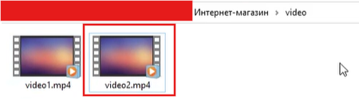
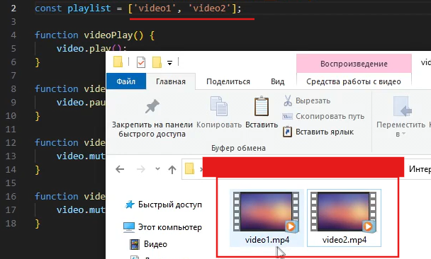

# 🎬 JS13 — Переключение видео с помощью кнопок Prev и Next

Здесь мы реализуем кнопки Prev и Next, а именно — функционал переключения видео при нажатии на кнопки.
---
## 🔹 Подготовка

Для начала подготовимся к уроку и скачаем ещё одно видео
(как это сделать — смотри в начале методички).
Будем реализовывать переключение между нашим старым и новым видео.



Теперь идём в наш файлик video-player.js

## 🔹 Создаём список видео

Для начала создадим список, в котором будут содержаться названия всех видео.
Так как в дальнейшем скрипте не планируется как-то изменять список, вместо переменной используем константу.

Чтобы создать список, ставим квадратные скобки:
```js
const playlist = ['video1', 'video2'];
```

В кавычках пишем название сперва одного видео, а после — через запятую — другого.
Если видео больше двух — логика не меняется.
Важно: пишем название без расширения .mp4.



## 🔹 Переменная для отслеживания текущего видео

Создадим переменную:
```js
let number = 0;
```

Эта переменная будет следить за тем, на каком видео мы находимся.
Можно проговорить ученикам, что в программировании отсчёт начинается с 0, а не с 1.

## 🔹 Функция переключения вперёд (Next)

Напишем функцию, которая будет переключать видео вперёд.
```js
function videoNext() {
  number++;
}
```

number++ — это то же самое, что number = number + 1,
то есть мы прибавляем 1 к текущему значению.

## 🔹 Как работает video.src

Разберём подробнее:

video.src — указывает путь к видеофайлу, который нужно проигрывать.

playlist[number] — берёт имя текущего видео из списка.

В html за отображение определённого видео ответственен атрибут src и теперь нам нужно как-то соединить его, переменную number и константу playlist.
На новой строке пишем: (обратите внимание, что тут используются обратные кавычки, которые находятся над табом, где буква Ё на клавиатуре).
```js
function videoNext() {
    number++;
    video.src = `video/${playlist[number].mp4}`;
}
```
### video/${playlist[number]}.mp4 
эта строка формируется динамически с использованием шаблонных строк (через обратные кавычки ``). Здесь:video/ — это папка, где находятся видеофайлы.${playlist[number]} — подставляется имя текущего видео из массива playlist..mp4 — расширение видеофайла.

## 🔹 Проверяем кнопку

Не забудем добавить кнопке Next атрибут onclick с нашей функцией.
Можно намеренно не добавлять и спросить учеников, почему кнопка не работает — пусть подумают сами.
```html
  <button class="video__next" onclick="videoNext()">Next</button>
```
## 🔹 Реализуем кнопку Prev

Теперь реализуем кнопку Prev.
Логика очень похожая — можно предложить hard-группе сделать это самостоятельно,
а с остальными разобрать вместе, чтобы mid-группа подсказывала логику.
```js
function videoPrev() {
    number--;
    video.src = `video/${playlist[number].mp4}`;
}
```
```html
  <button class="video__prev" onclick="videoPrev()">Prev</button>
```
## ✅ Готово!
---
💡 Дополнительно
1. Защита от выхода за границы списка

## Мы можем «выйти» из списка видео и вперёд, и назад — тогда видео пропадает. Исправим это.

а) Вперёд (Next)

Если мы доходим до последнего видео, нужно вернуться к первому.
Тут используется свойство length, которое возвращает длину массива.
```js
function videoNext() {
    if (number < playlist.length - 1){
        number++;
    } else {
        number = 0;
    }
    video.src = `video/${playlist[number].mp4}`;
}
```
Почему playlist.length - 1?
Потому что длина массива начинается с 1,
а нумерация элементов — с 0.

б) Назад (Prev)

В обратную сторону логика похожая:
если мы доходим до первого видео, возвращаемся к последнему.
Пусть hard-группа попробует реализовать самостоятельно.

```js
function videoPrev() {
    if (number != 0){
        number--;
    } else {
        number = playlist.length - 1;
    }
    video.src = `video/${playlist[number].mp4}`;
}
```

---
## 2. Отображение информации о видео

Сделаем так, чтобы при смене видео менялись заголовки.

а) Создадим два массива:

Один будет хранить названия видео, другой — имена авторов.

Пусть ребята попробуют создать их самостоятельно.

```js
const playname = ['ДаркСоулс','Дэд Стрэндинг']
const playauthor = ['Обзор игры от Sony','Обзор игры от Ubisoft']
```

б) Помещаем данные в HTML:

Мы уже делали подобное ранее — пусть ученики вспомнят.
Нужно подставлять значения в теги h3 и h4.
```js
const videoName = document.querySelector(".video__name")
const videoAuthor = document.querySelector(".video__author")
```
в) Добавляем обновление контента в функции переключения.
```js
function videoNext() {
    if (number < playlist.length - 1){
        number++;
    } else {
        number = 0;
    }
    video.src = `video/${playlist[number].mp4}`;
    videoName.innerHTML = playname[number];
    videoAuthor.innerHTML = playauthor[number];
}
function videoPrev() {
    if (number != 0){
        number--;
    } else {
        number = playlist.length - 1;
    }
    video.src = `video/${playlist[number].mp4}`;
    videoName.innerHTML = playname[number];
    videoAuthor.innerHTML = playauthor[number];
}
```
---
## 💡 Дополнительно из прошлых методичек

Если не делали — можно добавить:

Разместить название видео и имя автора прямо на видео
(см. инструкцию в методичке — ссылка
).

Разместить кнопки прямо на видео.

Стилизовать кнопки, если остаётся время.
