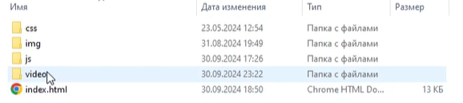
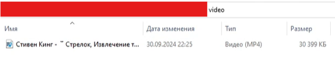
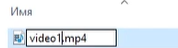
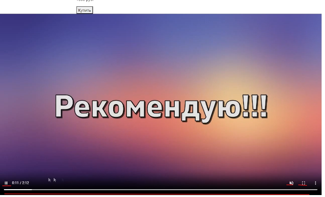
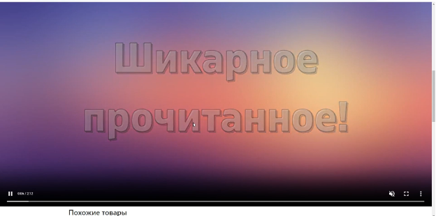

# JS11 — Видео-плеер (часть 1)

Это первая методичка из 3 на тему **Видео-плеера**, т.к. разные уровни детей будут заканчивать на разных этапах.
**Hard** пусть знакомые вещи реализовывают сами, а вы направляете.
Давайте им побольше возможностей поработать самим. Например, когда нужно расположить контент на видео, после `position: absolute` – пусть ребята пробуют сами расположить, а вы потом подскажите правильное решение, если не удалось никому.

---

## 🎬 Видео на фон

Мы уже интегрировали видео на наш сайт с помощью **YouTube**.
Но если вдруг YouTube сломается, то и видео на нашем сайте исчезнет.

Поэтому на этом уроке мы научимся добавлять видео на наш сайт с помощью тега `<video>`.
(А потом поставим его на фон!)

---

## Подготовка

Для начала подготовимся к работе и **скачаем видео себе на компьютер**.
Качать видео можно разными способами — если ученики их знают, или у них уже есть какое-нибудь видео на компьютере — отлично, это подойдёт.

Тут расскажу про один из простых способов — **как скачать видео с YouTube или RuTube**.

Для этого понадобятся по две ссылки на каждый способ:

* **RuTube:**

  * [https://rutube.ru/](https://rutube.ru/) – сам RuTube
  * [https://www.downloadvideosfrom.com/ru/Rutube.php](https://www.downloadvideosfrom.com/ru/Rutube.php) – сайт, который поможет его скачать

* **YouTube:**

  * [https://www.youtube.com/](https://www.youtube.com/) – сам YouTube
  * [https://vd6s.com/ru/](https://vd6s.com/ru/) – сайт, который помогает скачать видео

---

## 📥 Как скачать видео

1. Заходим на RuTube (или YouTube, если используете второй способ — процесс особо не отличается, но скриншоты будут по RuTube).
2. Вбиваем в поисковике нужное нам видео. Лучше выбрать видео покороче, чтобы быстро скачалось.


3. Заходим на видео и **копируем ссылку** на него.
4. Вставляем эту ссылку в **инпут** на сайте для скачивания видео.


5. Чуть-чуть подождём — и мы сможем загрузить его себе.


Если формат у видео **не `.mp4`** – можно воспользоваться конвертером. В интернете их много.
Например: [https://video-converter.com/ru/](https://video-converter.com/ru/)

---

## 🎞 Добавляем видео на сайт

Теперь копируем скачанное видео из **загрузок** в папку нашего сайта.
Создадим под него папку **`video`** и переименуем само видео для удобства работы с ним.








---

## 🧱 HTML-структура

Переходим в `index.html`, создаём отдельную секцию под наше видео.

```html
    <section class="video">
      
    </section>
```

По желанию ученики могут добавить `div` с классом `container`,
если хотят, чтобы видео было отцентровано и имело отступы по бокам.
Мы пока его добавлять **не будем**, чтобы оно было **во весь экран**.

Теперь добавим сам тег:

```html
<video class="video__video">
  <source src="video/video1.mp4" type="video/mp4" class="video__src">
</video>
```

---

## 🎚 Атрибуты тега `<video>`



Видео появилось на странице, но взаимодействовать с ним никак нельзя и оно не воспроизводится.
Пофиксим это и заодно расскажем ученикам о новых свойствах, которые помогают работать с `<video>`:

```html
<video class="video__video" autoplay muted controls>
  <source src="video/video1.mp4" type="video/mp4" class="video__src">
</video>
```

* `autoplay` – автоматически запускает видео (но браузеры часто отключают звук, чтобы не напугать пользователя).
* `muted` – выключает звук по умолчанию (тогда autoplay заработает).
* `controls` – добавляет стандартную панель управления (пауза, громкость, fullscreen и т.п.).



---

## 🖥 Делаем видео на всю ширину

Сделаем видео на всю ширину браузера, т.к. мы не используем контейнер.
Можно спросить у учеников, **как это реализовать**, прежде чем показывать решение.
```css
 width: 100%;
```
Также существует атрибут `loop`, который заставляет видео **воспроизводиться заново**, когда оно заканчивается.

---

## ✏️ Подпись под видео

Добавим под видео название и автора:

```html
<div class="container container__video">
  <h3 class="video__name">Название видео</h3>
  <h4 class="video__author">Автор видео</h4>
</div>
```

Можно спросить у учеников, какие заголовки здесь лучше использовать — `h3` или `h4`.

---

## 💡 Дополнительно

Дополнительно:

Можно сделать так, чтобы видео было у нас на фоне.
а) убираем у video__video атрибут controls, чтобы отключить панель у видео (тут подмечаем, что на следующем занятии создадим свой интерфейс управления).

б) Поместим наш уже написанный контент (h3 с названием видео и h4 с именем автора) на само видео. Для этого предлагаем обернуть их в новый div (да, у нас уже есть div с классами container и container_video, в котором они находятся, но если ученики захотели, чтобы у них видео было не во всю ширину, то этот класс у них будет оборачивать всё содержимое секции. Чтобы стандартизировать этот этап для всех – просто добавить новый div). Зададим ему класс video__content.

в) Для video__content задаём position: absolute, чтобы переместить наш контент на видео. Рассказываем, что это абсолютное позиционирование, которое выводит элемент из общего потока элементов (грубо говоря, элемент с таким позиционированием не влияет на расположение своих соседей). Но сейчас он располагает относительно всей страницы, ведь у родителя не задан никакой position.

г) Поэтому, чтобы было удобнее размещать, зададим родительскому элементу (section с классом video) position: relative

д) Но контент встанет всё равно не там, где нам нужно, так что нашему video__content пропишем bottom: 0, чтобы он встал в самом низу нашего родительского элемента ( то есть, section с классом video, а соответственно и самого видео, ведь оно у нас во всю ширину секции ).

е) Получилось, но теперь не слушает класс container. Чтобы работало так, как нам нужно – зададим нашему video__content ширину(width) элемента 100%.

ё) Теперь контент расположен так, как нам нужно, но на некоторых моментах видео чёрный текст может сливаться с фоном, так что воспользуемся популярной тактикой – полупрозрачный тёмный фон и светлый текст. Всё это задаём классу video__content, заодно можно подметить про принцип наследования (задали цвет текста video__content - родителю, а он изменился у video__name и video__author – детей). Тут ученики пусть поиграют со значениями. А ещё можно добавить сюда внутренние отступы (padding).
---

✅ **Итог:**
Теперь у нас есть собственное видео, встроенное на страницу,
оно воспроизводится, и мы можем сделать его красивым фоном с контентом поверх.

---
