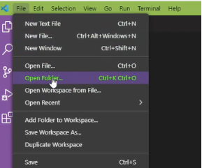
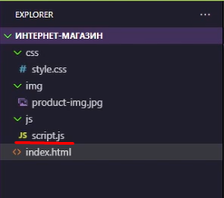
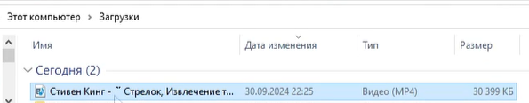

## 🚀 Урок: Кнопка (Подготовка к работе JS)

---

# 🎤 Вступление для преподавателя

Сегодня мы начинаем знакомство с JavaScript! ✨  
Объясните ребятам так:  
«JS — это как волшебник на сайте. HTML строит дом, CSS его украшает, а JavaScript оживляет: двери открываются, лампочки загораются, появляются новые кнопки и действия».  

Для разогрева можно сыграть в мини-игру:  
— Спросите у ребят, что бы они хотели оживить на сайте: кнопку, картинку или заголовок.  
— Запишите их ответы, и в конце урока покажите, что именно кнопка станет первой «живой» деталью.  

---

# 📖 Методичка

Это занятие для подготовки учеников к знакомству с JS.  
На этом занятии ученик вспомнит, как создавать проект, а также базовые теги и свойства, тем самым подготовит страничку для изучения JS.  
Научится подключать JS файл и изучит console.log().

---

### Шаги урока

1. Для начала вспомним, как создавать папку для сайта и структуру в ней. Не стесняемся спрашивать действия у учеников – это проходили. Если есть пробелы в знаниях – отрабатываем.  
2. Создаём папку на рабочем столе, даём ей название.  
3. В этой папке создаём ещё 3 папки: **css**, **img**, **js**.  


4. Обращаем внимание на новую папку **js**. Рассказываем, для чего она нужна и что там будет храниться.  
5. Заходим в редактор кода и открываем папку с помощью **Open Folder**.  



6. Создаём 2 файла: **index.html** и **style.css**.  


7. В **index.html** прописываем `!` и нажимаем Tab (если не работает — пишем html), чтобы появилась базовая структура html-документа.  

```html
<!DOCTYPE html>
<html lang="en">
<head>
    <meta charset="UTF-8">
    <meta name="viewport" content="width=device-width, initial-scale=1.0">
    <title>Document</title>
</head>
<body>
    
</body>
</html>
```

8. Вспоминаем, для чего нужны эти теги.  
9. Меняем содержимое тега `<title>` на название товара, который будет на странице. Можно дать ученикам время подумать и решить, какой товар будет продаваться на их странице.  
10. Подключаем **style.css** с помощью тега `<link>` в теге `<head>`.  
11. В теге `<body>` сразу пишем тег `<main>` с классом `main`.

```html
<body>
    <main class="main">
        
    </main>
</body>
```

12. Добавляем в тег `<main>` тег `<section>` с классом `product`.  

```html
<main class="main">
    <section class="product">
            
    </section>
</main>
```

13. В теге `<section>` добавляем тег `<div>` с классом `container`.  

```html
  <section class="product">
    <div class="container">
                
    </div>
  </section>
```

14. Переходим к наполнению страницы. Спрашиваем у учеников, какие элементы нужны для страницы товара, а также какие теги будем использовать.  
15. Если ученики уже понимают логику БЭМ, пусть пробуют подсказывать названия классов. Если нет – объясняем ещё раз.  
16. Добавляем тег `<h1>` с классом `product__title` — название товара.  

```html
<div class="container">
  <h1 class="product__title">Тёмная Башня</h1>
</div>
```

17. Добавляем тег `` с классом `product__img` — изображение товара.  

```html
<div class="container">
  <h1 class="product__title">Тёмная Башня</h1>
  
</div>
```

18. Ищем картинку в интернете, скачиваем в папку **img** (лучше сразу переименовать файл).  
19. Подключаем изображение через атрибут `src`.  
20. Добавляем тег `<h2>` с классом `product__title` — внутри пишем «Описание».  

```html
<div class="container">
  <h1 class="product__title">Тёмная Башня</h1>
  
  <h2 class="product__title">Описание</h2>
</div>
```

21. Добавляем тег `<p>` с классом `product__text`. Описание можно придумать самим или подсмотреть в интернете. 

```html
<div class="container">
  <h1 class="product__title">Тёмная Башня</h1>
  
  <h2 class="product__title">Описание</h2>
  <p class="product__text"></p>
</div>
```

22. Добавляем тег `<h2>` с классом `product__title` — пишем внутри «Цена:».  

```html
<div class="container">
  <h1 class="product__title">Тёмная Башня</h1>
  
  <h2 class="product__title">Описание</h2>
  <p class="product__text"></p>
  <h2 class="product__title">Цена</h2>
</div>
```

23. Добавляем тег `<p>` с классом `product__price` и пишем цену товара.  

```html
<div class="container">
  <h1 class="product__title">Тёмная Башня</h1>
  
  <h2 class="product__title">Описание</h2>
  <p class="product__text">...</p>
  <h2 class="product__title">Цена</h2>
  <p class="product__price">...</p>
</div>
```

24. Добавляем тег `<button>` с классом `product__btn` и пишем «Купить». Это важный элемент для работы с JS.

```html
<div class="container">
  <h1 class="product__title">Тёмная Башня</h1>
  
  <h2 class="product__title">Описание</h2>
  <p class="product__text">...</p>
  <h2 class="product__title">Цена</h2>
  <p class="product__price">...</p>
  <button class="product__btn">Купить</button>
</div>
```

25. Сохраняем и смотрим результат. Лучше проверять после каждого шага.  
26. Обращаем внимание, что без стилей страница выглядит просто. Обещаем исправить это позже.  
27. Создаём новый файл **script.js** в папке **js**.  



28. Подключаем его к html (объясняем сходство с подключением css и картинок). Показываем, почему скрипты подключают перед закрывающим тегом `</body>`.  

```html
  <script src="js/script.js"></script>
```

29. В **script.js** пишем `console.log()`. Внутри можно написать любой текст (например, «Привет, JavaScript!»).  

```js
console.log('Привееееет Компот)')
```

30. Показываем, как открыть консоль в браузере и увидеть результат.  



31. Обращаем внимание, что `console.log` станет нашим помощником при изучении JS.  
32. Конец основной части.  

---

### Дополнительно:  

1. Написать несколько `console.log`, построить небольшой диалог.  
2. Добавить стили для классов (не трогать `.container` — пригодится при изучении bootstrap).  
3. Добавить дополнительные элементы на страницу.  

---

# 🎯 Заключение для преподавателя

В конце урока у учеников будет:  

- структура сайта с HTML, CSS и JS;  
- первый скрипт с использованием `console.log`;  
- кнопка «Купить», готовая к будущей «оживлялке».  

Совет:  
- Пусть ребята напишут в `console.log` небольшую шутку или приветствие.  
- Можно устроить игру «Кто смешнее поздоровается с JavaScript?» 🎮  
- Важно, чтобы каждый увидел, что код оживает прямо в консоли — это создаст ощущение магии.  
