# ВМ 1 — Карточка товара

---

## На данном занятии

мы познакомимся с дополнительными тегами, а также новыми стилями.
(!!! Важно в конце занятия скачать работу на компьютер !!!)

---

## Подготовка

Заходим на сайт **liveweave - [https://liveweave.com/](https://liveweave.com/)**
Если есть работа, то на всякий случай скачиваем и потом загружаем базовый шаблон.

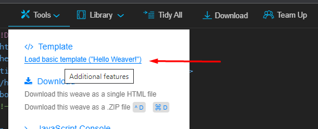

Удаляем всё ненужное.
В css будет пусто, а в html должно быть так
```html
<!DOCTYPE html>
<html lang="en">
<head>
  <meta charset="UTF-8">
  <meta name="viewport" content="width=device-width, initial-scale=1.0">
  <title>Document</title>
</head>
<body>
  
</body>
</html>
```
---

## Объяснение

Теперь объясняем ребятам что мы сегодня будем делать и показываем пример. Пример сделайте сами по методичке.
У меня такой пример

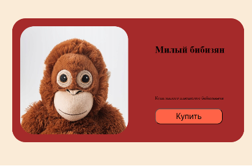

Даем ребятам немного времени подумать про какой товар они хотят сделать сайт. (помогаем выбрать неопределившимся ученикам, задавая наводящие вопросы)

---

## Начало работы

Первым делом напишем в теге title наименование товара.
```html
<title>Бибизян</title>
```
Теперь опять показываем пример и спрашиваем у ребят, какие элементы находятся на этой странице.
(Картинка, название товара, его описание и кнопка, а также элемент в котором всё это находится)

Сначала начнём с элемента, в котором всё находится. Реализуем его с помощью тега section. (объясняем для чего нужен этот тег)
```html
<body>
  <section>
    
  </section>
</body>
```
---

## Добавляем изображение

Теперь добавляем изображение, спрашиваем у ребят какой тег будем использовать для отображения картинки.
```html
<body>
  <section>
    
  </section>
</body>
```
Теперь вспоминаем за что отвечают атрибуты alt и src
В alt можно сразу написать что-нибудь. (но чтобы было со смыслом)
И сразу видим, что, если даже нет картинки, то по надписи сможем понять, что там должно быть изображено

Теперь пусть ребята найдут понравившееся изображение в интернете и скопируют ссылку на него.
!!! Важно, чтобы это была ссылка именно на изображение !!!
В разных браузерах наименование данного действия разное (например, в Google Chrome – копировать URL картинки; в Yandex – копировать адрес изображения)

Перед тем, как копировать ссылку на картинку, в поисковике лучше открыть размером побольше.

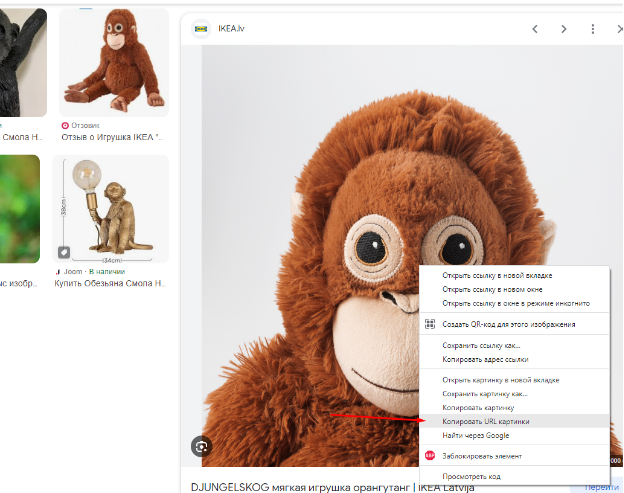

Теперь эту ссылку вставляем в значение атрибута src
```html
  <section>
    
  </section>
```
---

## Картинка появилась

Отлично!
Теперь добавляем остальные элементы (название товара, его описание и кнопка).
Обращаем внимание на то, что все эти элементы должны находиться внутри тега section.

Первым элемент – название товара. Вспоминаем с учениками какой тег нам тут нужен. (h1)
```html
  <section>
    
    <h1>Милый бибизян</h1>
  </section>
```
Теперь переходим к описанию (так же вспоминаем какой тег нужен, а нужен тег p)
```html

```
Очередь подошла к кнопке. Это новый элемент, который мы встречаем первый раз.
Можно у ребят спросить, как будет по английски слово кнопка.
Объясняем для чего нужен тег button.
```html
  <section>
    
    <h1>Милый бибизян</h1>
    <p>Купили милого плюшегого бибизяна</p>
    <button>Купить</button>
  </section>
```
---

## Проверка результата

Все элементы мы добавили и у всех должно получиться примерно вот так

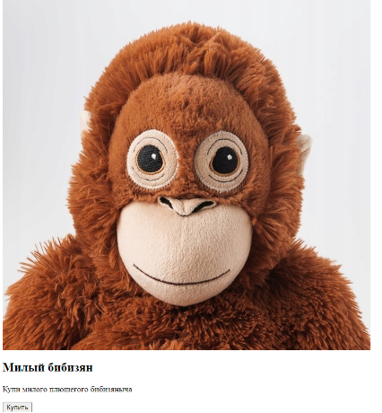

---

## Задаём фон страницы

Для того, чтобы видеть границы нашей карточки мы зададим цвет заднему фону всей странички.
```css
body{
    background-color: aqua;
}
```
Цвет ученики пусть выберут тот, который им нравится.
Но видим, что у нашей карточки товара цвет стал такой же.

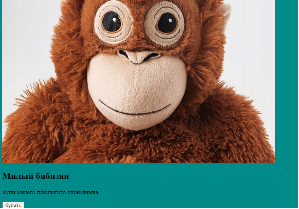

Спрашиваем у ребят как можно изменить цвет у карточки
или можно задать вопрос попроще: какому тегу будем задавать background-color (section)
```css
section{
    background-color: orange;
}
```

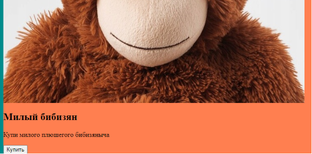

---

## Исправляем ширину карточки

Стало получше, но ширина этой карточки растягивается на всю ширину страницы.
Задаём фиксированную ширину. (спрашиваем у ребят какому тегу будем задавать свойство width).
Пусть ребята попробуют прописать разные значения.
```css
section{
    background-color: orange;
    width: 900px;
}
```
Теперь стало получше.

---

## Работа с картинкой

Можем у ребят спросить что им не нравится.
Скорее всего ответ будет – картинка слишком большая.
Сделаем её поменьше.

```css
img{
    width: 400px;
}
```

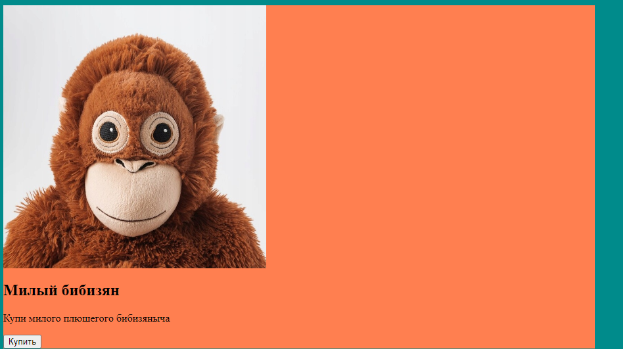

Выглядит намного лучше!

---

## Размещаем контент рядом

Теперь сделаем так, чтобы название, описание и кнопка были справа от картинки.
Для этого используем свойство display со значением flex. (рассказываем ребятам что даёт это значение, но не слишком много)

```css
section{
    background-color: orange;
    width: 900px;
    display: flex;
}
```

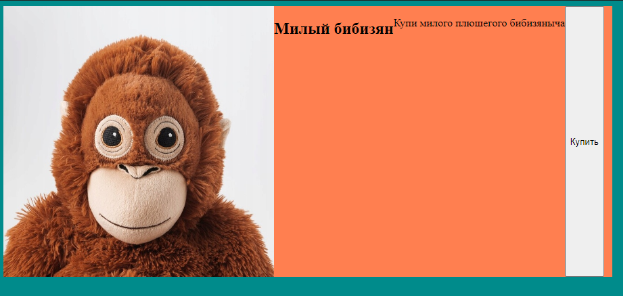

Видим, что результат не совсем тот, который мы бы хотели.
Спрашиваем у ребят, какие у них есть идеи.

После их идей знакомим с новым тегом div. (так же рассказываем для чего он нужен)
Помещаем туда название, описание и кнопку
```html
  <section>
    
    <div>
      <h1>Милый бибизян</h1>
      <p>Купили милого плюшегого бибизяна</p>
      <button>Купить</button>
    </div>
  </section>
```
И теперь всё так, как нам надо.

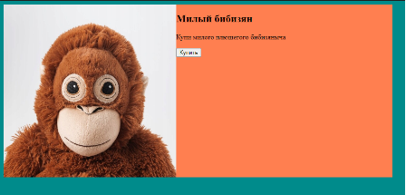

---

## Изучаем отступы

Теперь поближе познакомимся с отступами.

Начнём с внешних. Объясняем для чего нужно свойство margin.
Сделаем внешний отступ справа у картинки.
```css
img{
    width: 400px;
    margin-right: 80px;
}
```
Значение пусть ребята выберут сами.

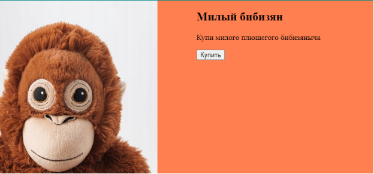

А теперь добавим внешние отступы для названия и описания.
Подсказываем, что есть margin-bottom и margin-top, и пусть ребята сами пробуют.
(Можно попросить всех ребят включить демонстрацию экрана и помогать по очереди, если возникают сложности)
Примерно должно получится так.
```css
h1{
    margin-bottom: 80px;
    margin-top: 100px;
}
p{
    margin-bottom: 45px;
}
```

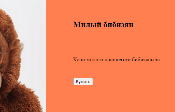

---

## Внутренние отступы

Теперь переходим к внутренним отступам.
Рассказываем ученикам про padding.
Применим это свойство для тега section. (значение пусть ребята сами выберут)

Обращаем внимание, что у padding, также есть padding-bottom, padding-right и т.д.
И аналогично есть свойство margin.

Когда используем margin или padding, то есть несколько способов задать значения.
1, 2, 3 или 4 значения. На padding можно попробовать все эти варианты и объяснить на примере как это работает.
В конце пусть ребята оставят понравившийся вариант.
У меня это 1 значение.
```css
section{
    background-color: orange;
    width: 900px;
    display: flex;
    padding: 30px;
}
```

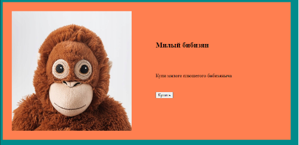

---

## Центрирование карточки

А теперь выровняем карточку по середине страницы.
Спрашиваем у ребят, как мы можем это сделать.
(Если ребята сильные, то могут попробовать сами)
Знакомимся со значением auto.
```css
section{
    background-color: orange;
    width: 900px;
    display: flex;
    padding: 30px;
    margin: 200px auto;
}
```
---

## Дополнительно (учитывайте время на скачивание работы на компьютер)

· Добавить округления углов для карточки и картинки с помощью border-radius
· Изменить стили названия и/или описания (размер, цвет)
· Изменить стили кнопки (внутренние отступы, размер текста, цвет текста, цвет заднего фона)
· Создать блок с картинкой или иконкой (после section) и потренировать margin и padding на нём.
· Добавить ссылку и стилизовать её под кнопку. Рассказать разницу между ссылкой и кнопкой. Где использовать тег button, а где тег a.

---

## Как скачать на компьютер работу

Лучше скачать одним файлом html.

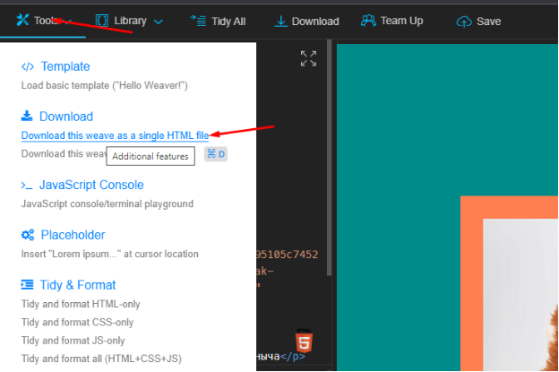

---

Хочешь, я теперь оформлю **JS12 и JS13 в таком же стиле**, сохраняя текст оригинальным — без правок вообще, только с визуальным оформлением Markdown (для GitHub)?
