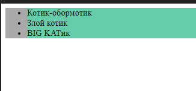
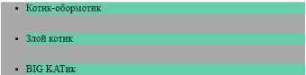
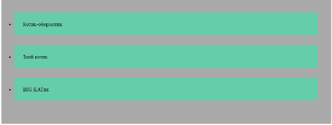
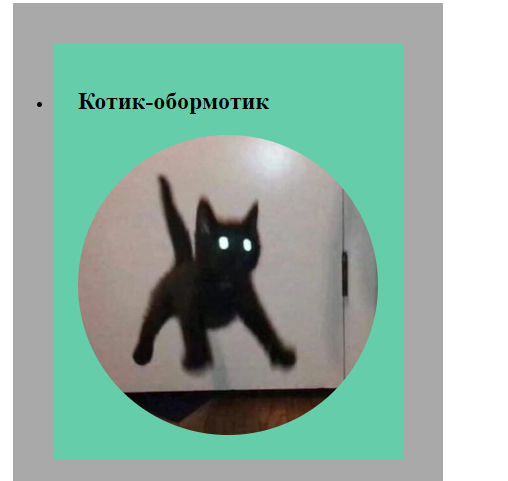

# 🐾 Урок 2. Крутой список

На этом занятии мы познакомимся со списком, а также с псевдоклассом hover и свойствами transition и transform.
---
## 🔹 Подготовка проекта

Загружаем базовый шаблон и удаляем всё ненужное.
---
## 🔹 Создаём список

Знакомимся с тегом списка ul и тегом элемента списка li.
Сделаем элемента 3 для примера.
```html
<body>
  <ul>
    <li></li>
    <li></li>
    <li></li>
  </ul>
</body>
```
У нас появятся 3 точки.
Можно для примера вместо ul написать ol.
Объясняем, в чём разница.

Пусть ребята подумают, какой список хотят сделать.
Если у кого-нибудь возникают сложности — помогаем.
(В моем случае это будет список котиков)
---
## ✏️ Запишем.
```html
<body>
  <ul>
    <li>Котик Обормотик</li>
    <li>Злой котик</li>
    <li>Big Котик</li>
  </ul>
</body>
```



Видим, что у нас появился список.
---
## 🎨 Стилизация списка

Чтобы лучше видеть, где сам список и каждый элемент, зададим им цвет заднего фона.
Спрашиваем ребят, какое свойство нам в этом поможет.
(Если ребята сильные — пусть все включат демонстрации экрана и попробуют сами.)
```css
ul{
    background-color: darkgray;
}
li{
    background-color: aqua;
}
```



Также добавим внешний отступ снизу, чтобы лучше было видно разделение элементов списка.
(Сильные ребята пусть пробуют сами.)
```css
li{
    background-color: aqua;
    margin-bottom: 30px;
}
```



Теперь мы лучше видим каждый элемент списка.

Для красоты добавим внутренний отступ самому списку и элементам списка.
(Сильные ребята пусть пробуют сами.)
```css
ul{
    background-color: darkgray;
    padding: 40px;
}
li{
    background-color: aqua;
    margin-bottom: 30px;
    padding: 25px;
}
```



Теперь список выглядит намного лучше.
Чтобы он выглядел ещё лучше — выровняем его по центру с помощью внешних отступов.
Но для этого нужно списку задать ширину.
```css
ul{
    background-color: darkgray;
    padding: 40px;
    width: 350px;
    margin: 0 auto;
}
```
---
## 🖼 Добавляем изображения

В элементах списка могут быть не только текст, но и другие элементы.
Например, помимо текста мы добавим картинку в каждый элемент списка.

Для удобства текст в наших тегах li поместим в тег h2.
Сначала сделаем для одного элемента списка.
```html
    <li>
      <h2>
        Котик Обормотик
      </h2>
    </li>
```
Теперь добавляем картинку
(пусть все ученики включат демонстрацию экрана и сами попробуют добавить изображение, обращаем внимание, что картинка должна быть внутри тега li).
```html
    <li>
      <h2>
        Котик Обормотик
      </h2>
      
    </li>
```
Чаще всего картинка будет слишком большая.
Сделаем её поменьше.
(Можно объяснить и показать размеры в процентах.)
```css
img{
    width: 100%;
}
```
---
## 💫 Украшаем и выравниваем

Для красоты можно сделать картинку немножко округлённой (или совсем круглой).
Если ученик не хочет — не заставляем.
```css
img{
    width: 100%;
    border-radius: 100%;
}
```


Чтобы выглядело ещё лучше, выровняем текст посередине
и удалим цифры или точки списка (по желанию).
```css
h2{
    text-align: center;
}
ul{
    background-color: darkgray;
    padding: 40px;
    width: 350px;
    margin: 0 auto;
    list-style: none;
}
```
## Получилось круто! 🎉
Пусть ребята включат демонстрацию экрана и доделают остальные два элемента списка
(добавят тег h2 и картинку).
---
## ✨ Псевдокласс hover

Со списком познакомились, теперь перейдём к псевдоклассу hover.
Сделаем так, чтобы при наведении на текст у нас менялся цвет шрифта.
```css
h2:hover{
    color: chartreuse;
}
```
Рассказываем немного про псевдоклассы.

Чтобы выглядело ещё круче — сделаем так, что при наведении на текст у нас менялся курсор.
(Курсор могут выбрать ученики.)
```css
h2{
    text-align: center;
    cursor: pointer;
}
```
---
## ⚙️ Свойство transition

Выглядит интересно, но слишком резко.
Познакомимся со свойством transition.
Значения пусть ребята поставят сами.
```css
h2{
    text-align: center;
    cursor: pointer;
    transition: 2s;
}
```
Теперь выглядит намного лучше.
---
## 🌀 Свойство transform

До конца занятия можно познакомиться со свойством transform.
Показываем и объясняем все значения на теге img,
а ребята потом могут сами выбрать сочетание, которое им понравится.

Не забываем добавлять transition для плавности.

Пример:

```css
img{
    width: 300px;
    height: 300px;
    border-radius: 100%;
    transition: 4s;
}
img:hover{
    transform: rotate(360deg);
}
```
---
## 💡 Дополнительно

Можно добавить градиент заднего фона к тегу body.
Поможет сайт: https://active-vision.ru/icon/gradient/

Изменить текст (размер, цвет, подчёркивание, тень).

Изменить картинку, ul, li (размер, округление, тень) —
https://active-vision.ru/icon/box-shadow/

Добавить в элемент списка текст и кнопку.
